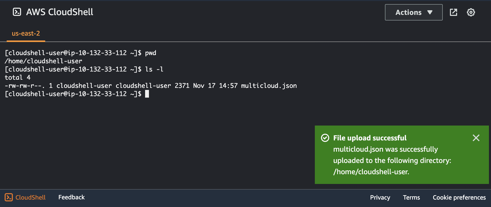

# ANT345 - Simplify working with data across multicloud with AWS analytics

In this session, we look at how you can use AWS analytic services to do in-place queries of data that lies outside of AWS. Specifically, we look at how you can use **Amazon Athena** to do ad-hoc queries of data in *Snowflake* and *Google BigQuery*, and how you can use **AWS Glue** to create a job that joins data from *Snowflake, Google BigQuery*, and *Azure Data Lake storage*. 

## Pre-requisites
Durng the session we show you how to configure the **Amazon Athena and AWS Glue connectors** for various data sources. However, before doing that configuration, there are some required pre-requisites, which are not shown during the session due to time constraints. Below we cover setting up the following pre-requisites. 

1. Creating Amazon Secret Manager secrets to store credentials for your data sources
2. Creating Amazon S3 buckets to be used by the Amazon Athena connectors for temporary storage and query results

### Creating Amazon Secret Manager secrets
Both the Amazon Athena and AWS Glue connectors make use of **AWS Secrets Manager** to store credentials securely. 

#### Configuring secrets for Snowflake
In this session we used Amazon Athena and AWS Glue to connect to Snowflake. However, we need different secrets for each AWS service, as the configuration for each is slightly different.

##### Configuring a secret for Amazon Athena to connect to Snowflake
Let's start by creating the secret that Amazon Athena will use to connect to Snowflake.

1.	Login to the **AWS Management Console**, and navigate to the [Secrets Manager](https://console.aws.amazon.com/secretsmanager) service
2.	On the Secrets Manager console, choose **Secrets** 
3.	Choose **Store a new secret**.
4.	For **Secret type**, select **Other types of secret**.
5.	Enter your Snowflake credentials as the following key-value pairs (click **+Add row** to add extra values).

       Key = `username`, Value = `your_snowflake_username`

       Key = `password`, Value = `your_snowflake_password`

   

6. Click **Next**, and then provide a **Secret name** (such as `athena/snowflake`), and optionally a **Description**. Then click **Next**
   
   
   
8. Leave the remaining fields at their defaults, and choose **Next**.
9. Select **Store** to save your secret.
    
   
   
##### Configuring a secret for AWS Glue to connect to Snowflake
In a similair way, we can store the secret that is needed for AWS Glue to connect to Snowflake. The process is the same as for the Athena secret outlined above, except that the key names are different. 

1. Repeat the Steps described for connecting Amazon Athena to Snowflake, **except for Step 5**, change to use the following key / value pairs.

     Key = `sfUser`, Value = `your_snowflake_username`

     Key = `sfPassword`, Value = `your_snowflake_password`

   
   
3. In Step 6, use a **Secret name** such as `glue/snowflake`

#### Configuring secrets for Google BigQuery
Let's now configure the secrets needed to connect to Google BigQuery, using both Amazon Athena and AWS Glue. 

##### Configuring a secret for Amazon Athena to connect to Google BigQuery
For Amazon Athena to connect to Google BigQuery, we need to provide our Google Cloud service account credentials JSON file in plain text to Secrets Manager. Amazon Secrets Manager will ensure that the credentials are encrypted. 

1. Login to the **AWS Management Console**, and navigate to the [Secrets Manager](https://console.aws.amazon.com/secretsmanager) service
2. On the Secrets Manager console, choose **Secrets** 
3. Choose **Store a new secret**.
4. For **Secret type**, select **Other types of secret**.
5. Under **Key/Value pairs**, change to the **Plaintext** tab, and then copy and paste your Google service account credentials JSON into the text box.
   
   
  	
8. Click **Next**, and then provide a **Secret name** (such as `athena/bigquery`), and optionally a **Description**. Then click **Next**
9. Leave the remaining fields at their defaults, and choose **Next**.
10. Select **Store** to save your secret

    

##### Configuring a secret for AWS Glue to connect to Google BigQuery
In a similair way to connect to Google BigQuery from AWS Glue,you will need to create and store your Google Cloud Platform credentials in a AWS Secrets Manager secret, then associate that secret with a Google BigQuery AWS Glue connection.

1. Download the  Google Cloud service account credentials JSON file. For AWS Glue, we need to base64 encode the secret and store the base64 encoded string in Secrets Manager. 
2. To base64 encode your JSON file, access the [AWS CloudShell](https://console.aws.amazon.com/cloudshell) service, click **Actions**, and then **Upload file**, and upload your Google credentials JSON file. 
   
   

4. At the **CloudShell command line**, run the following command: `cat credentialsFile.json | base64 -w 0`. Copy the base64 encoded string to the clipboard, and then you can delete the file you uploaded. 

      

6. In **AWS Secrets Manager**, create a secret using your Google Cloud Platform credentials. To create a secret in Secrets Manager, follow the steps previously provided. When selecting **Key/value pairs**, create a pair that has a keyname of `credentials`, and paste in the base64 encoded credentials as the value. 

   

### Creating Amazon S3 buckets needed for Athena

1. Login to the AWS Management Console, and navigate to the [Amazon S3](https://console.aws.amazon.com/s3) service
2. Click on **Create bucket**
3. For **Bucket name**, provide a unique name for a bucket that can be used to store your Athena query results. For example, `[AWS-account-number]-athena-query-results-[region]` as shown in the screenshot below. Then click **Create bucket**. 

   

4. Repeat Steps 2 and 3 to create a *spill* bucket for the Athena connector (this is used for larger queries where you may not have enough Lambda memory, and Athena can use this bucket to dump data for temporary storage). For **Bucket name**, provide a unique name for the spill bucket. For example, `[AWS-account-number]-athena-connector-spill-[region]` as shown in the screenshot below. Then click **Create bucket**.

   
   

